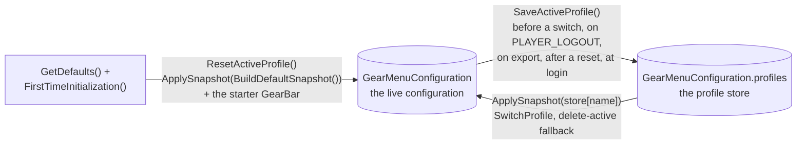
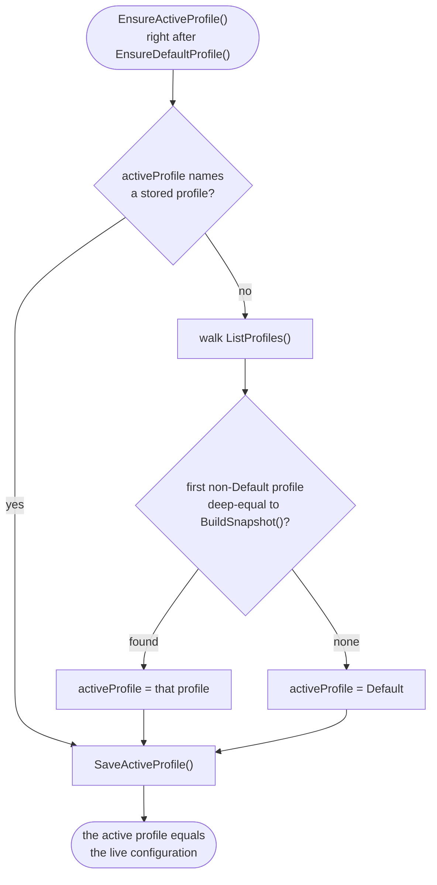

# Development

#### Invtypes

A list of invtypes that are relevant to the addon

INVTYPE_HEAD
INVTYPE_NECK
INVTYPE_SHOULDER
INVTYPE_CHEST
INVTYPE_ROBE
INVTYPE_WAIST
INVTYPE_LEGS
INVTYPE_FEET
INVTYPE_WRIST
INVTYPE_HAND
INVTYPE_FINGER
INVTYPE_TRINKET
INVTYPE_CLOAK
INVTYPE_WEAPON
INVTYPE_SHIELD
INVTYPE_2HWEAPON
INVTYPE_WEAPONMAINHAND
INVTYPE_WEAPONOFFHAND
INVTYPE_HOLDABLE
INVTYPE_RANGED
INVTYPE_THROWN
INVTYPE_RANGEDRIGHT
INVTYPE_RELIC
INVTYPE_AMMO


#### SlotTypes

A list of slotTypes that are relevant to the addon

* INVSLOT_HEAD
* INVSLOT_NECK
* INVSLOT_SHOULDER
* INVSLOT_CHEST
* INVSLOT_WAIST
* INVSLOT_LEGS
* INVSLOT_FEET
* INVSLOT_WRIST
* INVSLOT_HAND
* INVSLOT_FINGER1
* INVSLOT_FINGER2
* INVSLOT_TRINKET1
* INVSLOT_TRINKET2
* INVSLOT_BACK
* INVSLOT_MAINHAND
* INVSLOT_OFFHAND
* INVSLOT_RANGED
* INVSLOT_AMMO

## Development Tools

### Docker Compose Services

The project includes Docker Compose services for development and validation tasks. Each service is containerized and requires no local setup beyond Docker.

**Available Services:**

```bash
# Code Quality
docker compose run --rm luacheck                    # Run lua linting
docker compose run --rm luacheck-report             # Generate lua lint report

# Tests
docker compose run --rm busted                      # Run busted unit tests
docker compose run --rm busted-report               # Generate busted test report
```

**Output Files:**
Services with "-report" suffix generate output files in the `./target/` directory:
- `./target/luacheck-junit.xml` - Luacheck results in JUnit format
- `./target/busted-junit.xml` - Busted test results in JUnit format

### Running Luacheck

The project uses [Luacheck](https://github.com/lunarmodules/luacheck), a static analyzer and linter for Lua, to ensure code quality and catch common issues.

**To run Luacheck:**

```bash
docker compose run --rm luacheck
```

This will:
- Mount the project directory as read-only
- Run Luacheck on all Lua files
- Output any warnings or errors found

**To generate a report:**
```bash
docker compose run --rm luacheck-report
```

This generates a JUnit XML report in `./target/luacheck-junit.xml`.

**Configuration:**
- `.luacheckrc` - Contains Luacheck configuration, including:
  - Global variables specific to WoW addons
  - Lua 5.1 standard for compatibility
  - Excluded directories (e.g., `target/`)

### Running Tests

The project uses [busted](https://lunarmodules.github.io/busted/) for headless unit tests. Specs
live under `test/headless/spec/`; a busted helper at `test/headless/Bootstrap.lua` sets up the addon
globals and loads the pure modules so they can be tested without the WoW client running. The
`test/headless/` subfolder keeps these headless specs separate from the manual in-game test cases
under `test/manual/`. The release test procedure - automated gates, the in-game test matrix and
the manual test case catalog - is documented in [test/TESTING.md](test/TESTING.md).

**To run the test suite:**

```bash
docker compose run --rm busted
```

This will:
- Mount the project directory as read-only
- Run busted against the `test/headless/spec/` directory (configured via `.busted`)
- Report the number of successes / failures / errors

**To generate a report:**
```bash
docker compose run --rm busted-report
```

This generates a JUnit XML report in `./target/busted-junit.xml`.

**Configuration:**
- `.busted` - busted run configuration (spec root, the bootstrap helper, the `Spec.lua` pattern)
- `test/headless/Bootstrap.lua` - test globals and pure-module bootstrap
- `test/headless/WowStubs.lua` - opt-in registry of WoW-global stubs

### Testing and Code Quality

Before committing changes:

1. Run Luacheck to ensure code quality: `docker compose run --rm luacheck`
2. Run the unit tests: `docker compose run --rm busted`
3. Test the addon in-game with `/reload` to ensure functionality works correctly
4. Verify the addon loads without errors

## Profiles

The configuration profiles (`code/Profile.lua`, `rggm.profile`; the page is
`gui/ProfileMenu.lua`) are the family feature every sibling addon carries, cloned from
the Quartermaster reference implementation (family spec CMI-0006) - keep the shape below
when touching it, so a reader can move between the repos.

**Two data homes.** The live configuration is `GearMenuConfiguration`: what every
setter writes and every reader reads. The profile store is
`GearMenuConfiguration.profiles = { [name] = snapshot }`, one stored copy per profile. A
profile captures the `PROFILE_FIELD_SPEC` fields - the general options, the item quality
filter, `gearBars` (every bar with its slots, sizes, orientation, lock state, key-binding
labels and position), `quickChangeRules`, `frames`, the TrinketMenu settings, `uiTheme`,
the Season of Discovery rune option and the base-item fallback. Bookkeeping stays out of
it: `addonVersion`, `firstTimeInitializationDone`, the store itself and `activeProfile`,
the name of the profile the live configuration belongs to. `activeProfile` is written
only by `EnsureActiveProfile`, `SwitchProfile`, `CreateProfile`, `DeleteProfile` and
`RenameProfile`, and it is deliberately absent from `CONFIGURATION_DEFAULTS` - a
backfilled `"Default"` would make the adoption below dead code.

**The mirror rule.** Edits always belong to the active profile, but nothing hooks the
setters. `SaveActiveProfile()` copies the live configuration into `store[activeProfile]`
at five moments: before a switch, on `PLAYER_LOGOUT` (a gated bus registration in
`Core`; the event fires on logout, `/reload` and disconnect before the SavedVariables are
written, and not on a crash), on export, after a reset, and at the end of
`EnsureActiveProfile()` at every login - the self-heal for a logout the mirror missed.
Between those moments the live SavedVariable is the truth. A nil or dangling active
name is repaired to Default before the mirror lands.

**Adoption at login.** `Core.Initialize` runs `EnsureDefaultProfile()`, which seeds
Default only when the store has none, and then `EnsureActiveProfile()`: a store that
names a stored profile keeps it; the first login after the upgrade from the snapshot
model (no `activeProfile` yet) or a name whose profile went activates the first
non-Default profile whose stored copy deep-equals the live configuration
(`Common.DeepEquals` - the player applied it and changed nothing since), else Default.
Either way the login ends with the active profile equal to the live configuration.

**Default and Reset to defaults.** Default is the editable home profile every character
starts on: never deleted, renamed, imported over or created over
(`profile_error_default_cannot_be_overwritten` reads "reserved name"), otherwise a
profile like any other. The factory settings are not a profile any more -
`ResetActiveProfile()` applies `BuildDefaultSnapshot()` (`GetDefaults()`, the userOwned
collections empty) to the live configuration, runs
`Configuration.FirstTimeInitialization()` so the starter "Default GearBar" (trinket 1 /
trinket 2 / head) comes back like on a fresh install, and mirrors the result into the
active profile.

**Switch, delete, export.** `SwitchProfile(name)` mirrors, applies `store[name]` and
makes it active. `DeleteProfile(name)` of the active profile applies Default and
returns a second value `fellBack`, with no mirror before or after (it would resurrect
the deleted profile). Every page path that applies a snapshot - Load, Reset to
defaults, deleting the active profile - is wrapped in the key-binding dance:
`keyBind.ClearGearBarKeyBindings(gearBarManager.GetGearBars())` before (the outgoing
bars' WoW bindings would otherwise keep firing slots that no longer exist),
`keyBind.ApplyGearBarKeyBindings()` after (the profile carries the binding labels, not
WoW's binding cache), then `ReloadUI()` so every GearBar, the ChangeMenu and the
TrinketMenu rebuild from the applied state (the post-reload logout mirror re-writes the
`SetupConfiguration`-normalised copy - harmless). Export mirrors first and then exports
the stored copy of the selected row, so the active row exports the live settings; an
import is stored inactive. Accepted quirk: a stored profile from an older schema lacks
the newer fields, `ApplySnapshot` keeps the live value for those and the first mirror
persists it.

**Adding a field to a profile.** One entry in `CONFIGURATION_DEFAULTS` in
`code/Configuration.lua` (the backfill covers existing characters) and one line in
`PROFILE_FIELD_SPEC` in `code/Profile.lua` with its Lua type (import validates it).
Never `activeProfile`.

**Page to module.** Every confirm answers Yes / No, every name prompt Accept / Cancel;
the click guards print the refusal a greyed button already shows. "Key-binding dance"
means `ClearGearBarKeyBindings` before the module call and `ApplyGearBarKeyBindings`
after it, right before the `ReloadUI()`.

| Button / popup | Module call | Greyed while | Reloads |
|---|---|---|---|
| Create new Profile (`RGGM_PROFILE_CREATE`, name prompt) | `CreateProfile(name)` - mirror, copy, activate | never | no |
| Load (`RGGM_PROFILE_LOAD`) | `SwitchProfile(name)`, key-binding dance around it | nothing selected, the active row | yes |
| Rename (`RGGM_PROFILE_RENAME`, name prompt) | `RenameProfile(old, new)` - the active name follows | nothing selected, Default | no |
| Delete (`RGGM_PROFILE_DELETE`, `RGGM_PROFILE_DELETE_ACTIVE` on the active row) | `DeleteProfile(name)` -> `deleted, fellBack`, key-binding dance on the active row | nothing selected, Default | only when `fellBack` |
| Reset to defaults (`RGGM_PROFILE_RESET`) | `ResetActiveProfile()`, key-binding dance around it | never | yes |
| Export | `SaveActiveProfile()`, then `ExportString(GetProfile(name), name)` | nothing selected | no |
| Import (`RGGM_PROFILE_IMPORT`, name prompt prefilled from the string) | `ImportString(text)`, then `SaveProfile(name, payload)` - stored inactive | never | no |
| Key-binding dance (every reload above) | `keyBind.ClearGearBarKeyBindings(gearBarManager.GetGearBars())` before, `keyBind.ApplyGearBarKeyBindings()` after | - | precedes `ReloadUI()` |

**Profile data flow**



**Adoption at login**



## Dependency Management

This repository uses [Renovate](https://renovatebot.com/) for automated dependency updates. Renovate monitors and updates:

- Maven dependencies (plugins and libraries)
- GitHub Actions versions
- World of Warcraft interface versions and related properties
  - `addon.interface` - WoW interface version
  - `addon.supported.patch` - WoW patch version
  - `addon.curseforge.gameVersion` - CurseForge game version ID

The configuration can be found in `renovate.json`. Renovate runs on a weekly schedule and creates pull requests for available updates.
